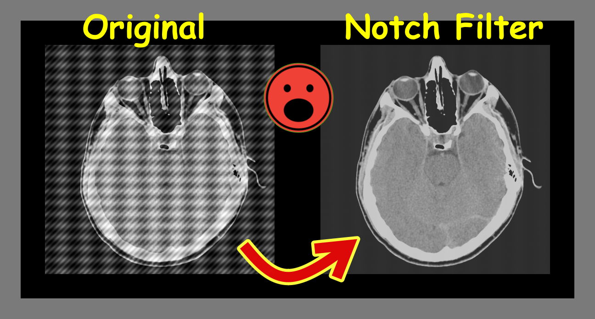

# Frequency Domain Filters

Frequency Domain Filters are used for smoothing and sharpening of image by removal of high or low frequency components. Sometimes it is possible of removal of very high and very low frequency.

## Aplication

Remove Periodic Noise

    

## Acknowledgements
*Documentation of specific functions was inserted just click on it :) 
 - [Python](https://www.python.org/)
 - [Numpy](https://numpy.org/doc/stable/reference/generated/numpy.fft.fft2.html#:~:text=numpy.fft.fft2%C2%B6%20numpy.fft.fft2%20%28a%2C%20s%3DNone%2C%20axes%3D%28-2%2C%20-1%29%2C%20norm%3DNone%29%20%5Bsource%5D,of%20the%20input%20array%2C%20i.e.%2C%20a%202-dimensional%20FFT.)
 - [Matplotlib](https://matplotlib.org/stable/api/_as_gen/matplotlib.pyplot.imshow.html)
 - [OpenCV](https://docs.opencv.org/4.x/d2/d0b/tutorial_periodic_noise_removing_filter.html)

## Authors

- [Miguel Ángel Hernández Tapia](https://github.com/MiguelAngel-ht)

