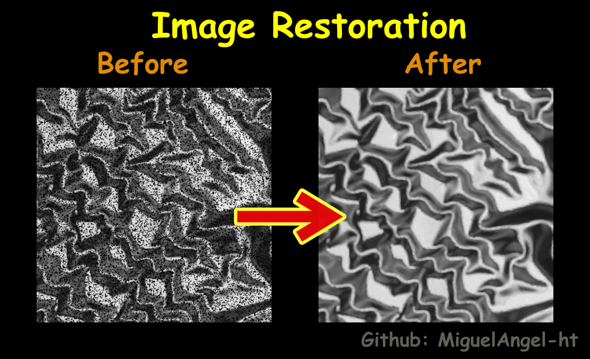

# Image Restoration

Image restoration is the operation of taking a corrupt/noisy image and estimating the clean, original image. 
Corruption may come in many forms such as motion blur, noise and camera mis-focus.

This file contains adpmedian and spfilt functions in python using numpy and opencv. Those functions are originals from the book Digital Image Processing by Gonzalez...

    

## Acknowledgements
*Documentation of specific functions was inserted just click on it :) 
 - [Python](https://www.python.org/)
 - [Numpy](https://numpy.org/doc/stable/reference/generated/numpy.flipud.html#numpy.flipud)
 - [Matplotlib](https://matplotlib.org/stable/api/_as_gen/matplotlib.pyplot.imshow.html)
 - [OpenCV](https://docs.opencv.org/3.4/d7/dfc/group__highgui.html#ga8daf4730d3adf7035b6de9be4c469af5)

## Authors

- [Miguel Ángel Hernández Tapia](https://github.com/MiguelAngel-ht)

