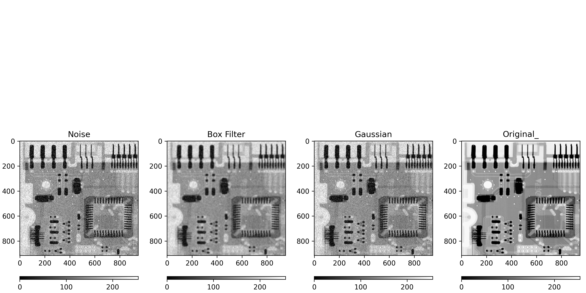
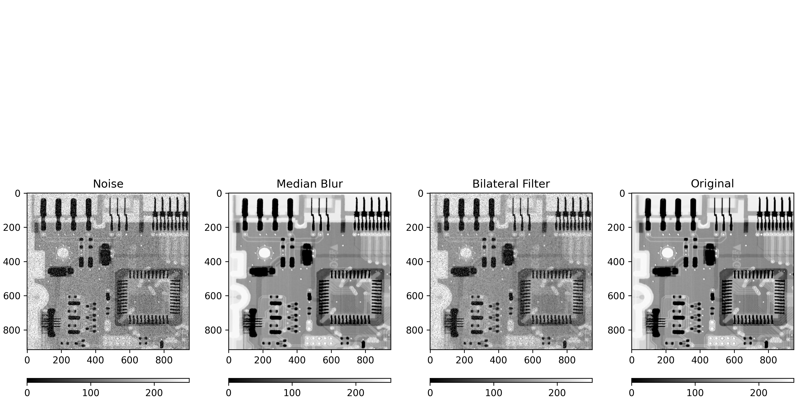

# Smooting Images

Image blurring is achieved by convolving the image with a low-pass filter kernel. It is useful for removing noise. It actually removes high frequency content (eg: noise, edges) from the image. So edges are blurred a little bit in this operation (there are also blurring techniques which don't blur the edges).

## Average

This is done by convolving an image with a normalized box filter. It simply takes the average of all the pixels under the kernel area and replaces the central element. 

##  Gaussian Blurring

This is done by convolving an image with a Gaussian kernel.

## Median Blurring

akes the median of all the pixels under the kernel area and the central element is replaced with this median value. This is highly effective against salt-and-pepper noise in an image.

## Bilateral Blurring

This is highly effective in noise removal while keeping edges sharp. But the operation is slower compared to other filters. 

## RESULTS

    

    

## Acknowledgements
*Documentation of specific functions was inserted just click on it :) 
 - [Python](https://www.python.org/)
 - [Numpy](https://numpy.org/doc/)
 - [Matplotlib](https://matplotlib.org/stable/api/_as_gen/matplotlib.pyplot.colorbar.html)
 - [OpenCV](https://docs.opencv.org/4.x/d4/d13/tutorial_py_filtering.html)

## Authors

- [Miguel Ángel Hernández Tapia](https://github.com/MiguelAngel-ht)

